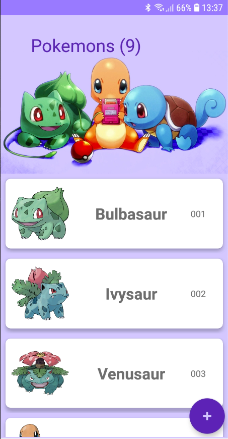
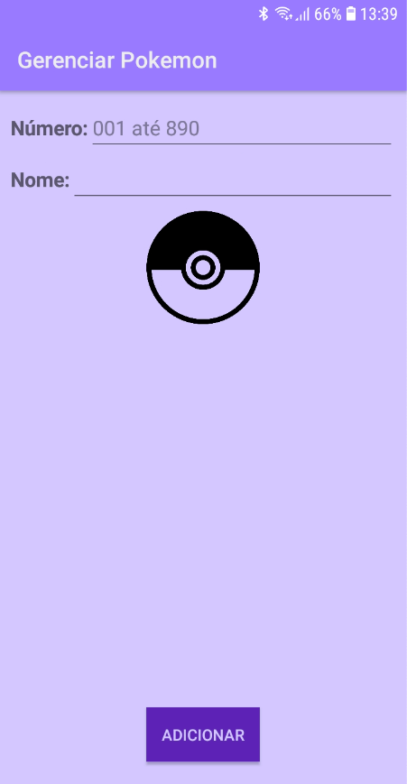
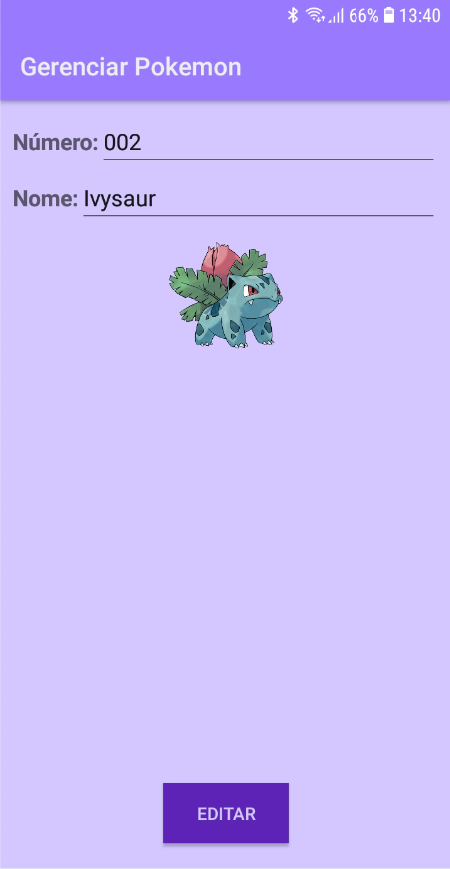

### Atividade 1 de Android

### Atividades a serem trabalhadas nas próximas duas semanas:

- Criar um cadastro qualquer, porém mais completo que o de cidades
- Usar RecyclerView com adapter, padrão MVC e singleton
- Desafio: colocar este cadastro na estrutura de NavigationView com single Activity

# Screenshots

