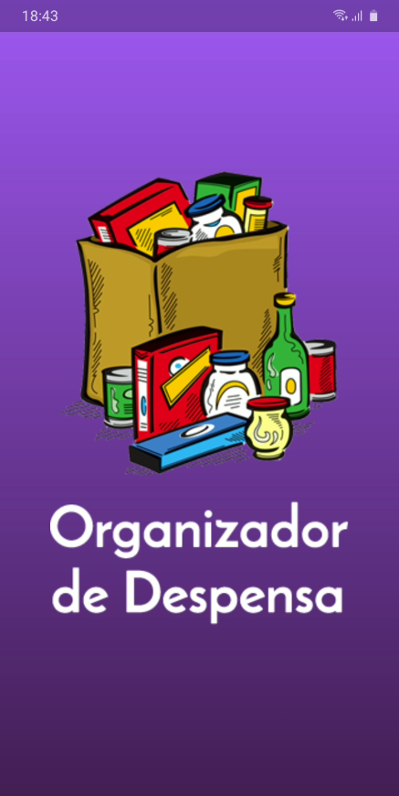
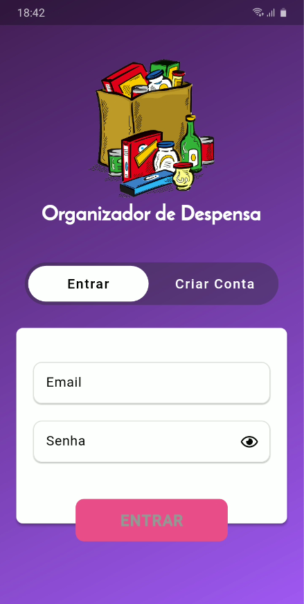
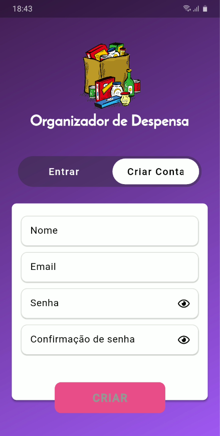
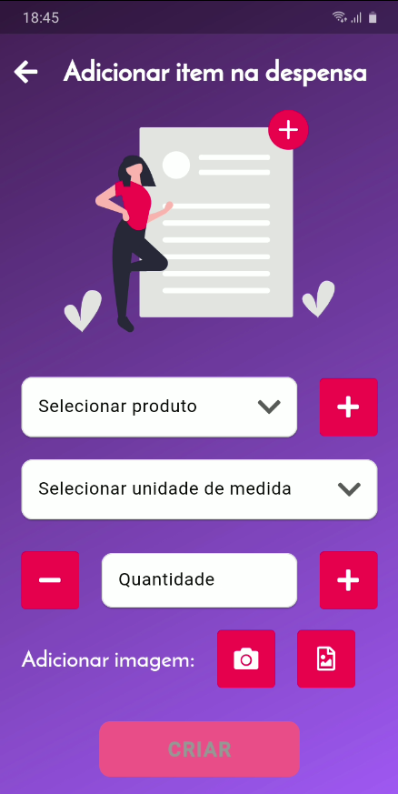
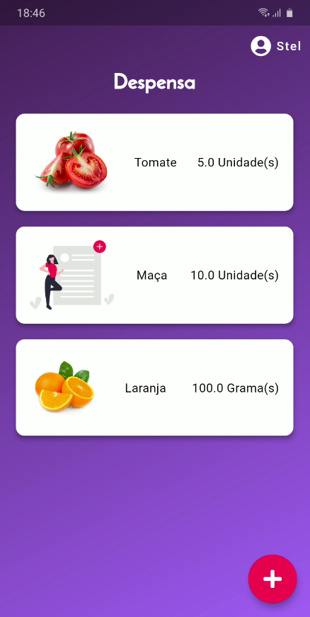
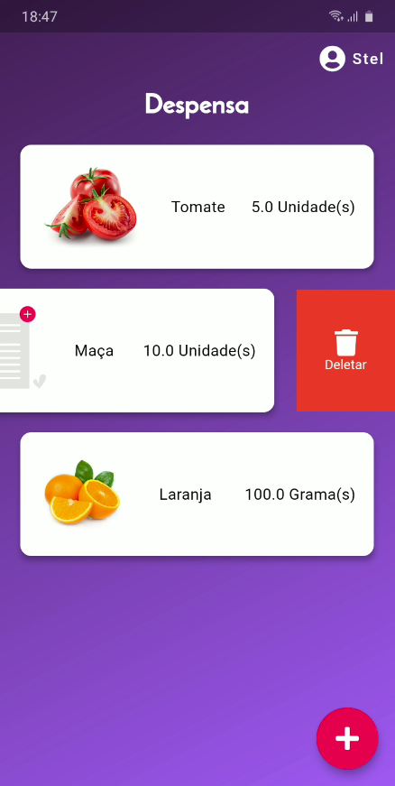

# storeroom_organizer

Projeto criado para a matéria de WebApps da PUC-PR 2020

## Instruções

Rodar os seguintes comandos, nessa ordem:
    
    - flutter pub get
    
    - flutter pub run build_runner build --delete-conflicting-outputs

## Detalhes

Nessa versão, é possível:

    - Criar usuário
    
    - Visualizar a despensa por usuário
    
    - Adicionar, editar e excluir itens na despensa

## Screenshots

