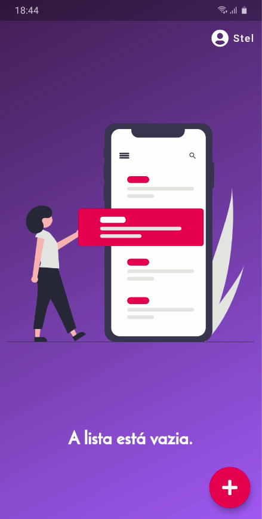
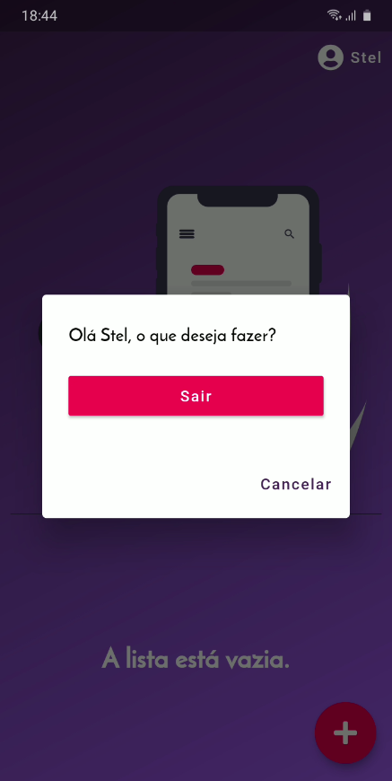

# storeroom_organizer

Projeto criado para a matéria de WebApps da PUC-PR 2020

## Detalhes

Nessa versão, é possível:
    - Criar usuário
    - Visualizar a despensa por usuário
    - Adicionar, editar e excluir itens na despensa

## Screenshots

